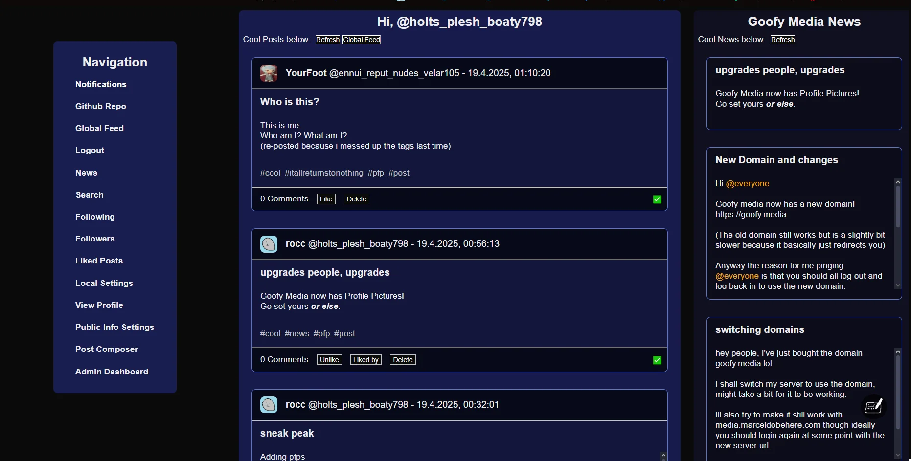

# Goofy Media

This is the frontend for Goofy Media written int NextJS.

It is statically hosted [here](https://marceldobehere.github.io/goofy-media-front/).

Backend is [here](https://github.com/marceldobehere/goofy-media-back).

If you want to register an account, just send me a message on discord or reach out.

## Screenshots





## General Infos

### Security
Users have a public/private keypair that is used to encrypt and verify/sign data.

The public key is integrated in the user profile and in the generated handle.

The private key can be stored locally on the device or by using a username and password it can be stored on the server encrypted, so that only the user can ever decrypt and access it.
When registering, you can choose whether you want to store the private key on the server or not.

Every post, comment, follow, like, etc. gets signed, so that the server and the other users can verify the authenticity of the data. 
This means that an evil server cannot tamper with posts, comments, etc. without them being marked as invalid. (Outside of deleting entries)

Additionally there are no sessions, all requests from the client are signed with the private key and the server can verify them using the public key.
This is pretty useful since every request is validated and the server can be restarted/updated without logging out users.

### Decentralization
Goofy Media aims to be a decentralized social media platform.

The intended use-case is to open an instance for a group of friends or a small community.

Each instance can be accessed but they are normally isolated from each other.

Though, if wanted, several servers can join together into a cluster and essentially act as one big server.
(Of course things like moderation and user management is up to the instances themselves. And also this is still WIP)

### Server Privacy
When you host a server instance, you can select which parts of the server can be publically accessed and which parts are private.

A server can be fully public with guests being able to access it or fully private, only accessible to registered/trusted users.

(This feature is also WIP)

### User Privacy
User accounts do not require emails or any other personal information. 
The only important thing is the registration code, which you will need to get from a server administrator.

You can also use a username and password to store your private key on the server, but this is not required.
Additionally the password is not stored on the server, it is merely used as a encryption key to encrypt the private data and only a hash of the username gets stored on the server.

Outside of that the server does store necessary information like the public key, the handle, posts, comments and such.

(A feature to request and or delete your data is planned)

### DMs
DMs are not implemented yet, but they are planned.

Users will be able to send DMs to other users, which will be End-to-End encrypted by default.

DM messages will be stored on the server, but they will be stored encrypted and only the sender and receiver will be able to decrypt them.

Detailed info will follow when the feature is implemented.

### Server Rules
Please do not post any illegal content on Goofy Media or anything that would violate the rules of the server you are using.

Specific server rules will be added but for now the most important thing is no illegal or inappropriate content, using some commonsense.


## Issues

### Failed to register!
If you try to register and get this error it can have several reasons. 
For example the server is offline, some data is corrupt or your device is causing a very strange bug.

You can check if the very strange bug is happening by looking at your console and looking for something like `> Failed sent request:  Signature verification failed`.

If this is NOT the case, it is probably due to the server being down temporarily or some other thing. 
I'd recommend refreshing the page and trying it again in a few minutes.
If that still doesn't work, please contact me!

#### Weird bug

If you do see the line, then your device is causing a very strange bug and I am trying to fix it, though it is very strange.
I would recommend attempting to register and use the site logged in on another desktop or a mobile device, as that seems to work fine.
If you are experiencing this bug, I am very sorry for the trouble and if you want you can contact me, so I can collect more information about the issue!

If you are curious about the bug details:
* Essentially, each request your client sends gets signed using the public/private keypair and sent out to the server
* The client sends the body, id, validUntil, public-key and signature as extra geaders
* The server receives the endpoint and if there is no authentication it processes it normally
* But if the endpoint requires authentication the server parses the headers and verifies them
* Firstly it checks if all headers exist, otherwise it returns `Unsigned request unauthorized`
* Then it constructs the object out of the request data and checks the validity using the signature
* If the signature is invalid it returns `Signature verification failed`
* If the verification succeeds, it gets the userId based on the public-key and handles the stuff


Getting the `Signature verification failed` error means that you provided a signature but it was invalid for some reason.
This in itself is pretty strange and only has happened to 2 devices before. 

What makes it weirder is that a public/private keypair that is known to work also fails on those devices but not others.

Additionally when running it locally on those devices, things get even stranger:

Running everything locally on those devices does not work regardless of the browser used, unless the server is running locally and the client is opened in a private tab. This for some unknown reason does work for both the client running locally and the statically hosted client.

Even weirder neither the local nor the external client work with the normal server in a private tab.

I am honestly not sure why specifically that happens, but I will try to figure it out and fix it.


### Styling Info
Posts can be styled using markdown.
```
# Hi
This is a *very* **cool** text.

* This
* is
* a
* list

## Bla Bla
yes this also works

```

Additionally, pictures, videos and audios can be embedded using ``

Embedded media can autoload depending on the user settings. Autoloading is off by default for security reasons.

There is also syntax highlighting for code blocks

Custom css can also be added for blocks by using the following `<style "...">...</style>` "element":
```html
<style "border:4px solid red;width:250px;height:350px;font-family:'Comic Sans MS';background:radial-gradient(red, green, blue);">
  This is a test element
  It is very cool
</style>
```
Most properties will work just fine. Notable exclusions are `position` and any URLs.

## Features
Goofy Media is still a WIP and far from done but it has enough features to be usable currently.

Note that its just me working on this in my free time, so don't expect constant updates and 24/7 support.

### Implemented
Here are some of the implemented features:
* [X] A Cool Index Page
* [X] Functional UI (will improve with time)
* [X] Basic User System with Registration, Login and Logout (Users and Admins)
* [X] Admin Dashboard
* [X] Registration Code System
* [X] Full Server data export and import in JSON format 
* [X] Post System with support for markdown, css, embedded media and user mentions
* [X] Post composer with all of the support as well as a preview
* [X] Post creation
* [X] Automatic Post verification
* [X] Global Feed
* [X] News Feed
* [X] Tag System
* [X] Tag Search (With post counts)
* [X] Post Tag Validation
* [X] Home Page with infinite scroll and dynamic post loading
* [X] Profile Page
* [X] Account Settings (Including custom CSS overrides and cool settings)
* [X] Comment System with support for nested comments
* [X] Like System (Liking, Unliking, showing liked posts)
* [X] Follow System (Following, Unfollowing, showing following and followers)
* [X] User Feed based on the followed users
* [X] Notification System (Follows, Likes, Comments, Mentions)
* [X] Notification Page
* [X] User Feedback
* [X] QR Code login (Generation and upload of QR codes to log in)
* [X] Short-Links for posts and user profiles
* [X] Responsive Design with support for mobile devices
* [X] Support for guest users
* [X] Client-side caching of data


### TODOs
Here are some of my TODOs:
* [ ] Some kind of privacy policy / GDPR notice
* [ ] Password rules for registration (enforced by the client)
* [ ] Optional Anonymous Feedback
* [ ] Seeing who liked your post
* [ ] Live Notification polling or using WS
* [ ] Listing most common/used tags? (Maybe 24h, a week, a month or all time)
* [ ] Bookmarking Tags (Bookmarking, Unbookmarking, showing bookmarked tags, Feed for bookmarked tags)
* [ ] Post editing
* [ ] Post deletion
* [ ] Comment deletion
* [ ] Delete user and all user data
* [ ] Export all user data
* [ ] API Rate Limiting
* [ ] Post sharing
* [ ] Probably Keeping the tag order correctly (currently auto sorted alphabetically)
* [ ] Blocking System (Blocking, Seeing blocked users, unblocking, automatic filtering of content from blocked users)
* [ ] Improved Commenting UI
* [ ] Short Links including metadata for embedding on other sites
* [ ] Basic Admin Moderation (deleting posts, comments, users) (All actions will be signed and stored in a different table or something)
* [ ] Reporting System
    * [ ] Post reporting
    * [ ] User reporting
    * [ ] Comment reporting
    * [ ] Tag reporting
* [ ] Client side like and follow validation
* [ ] Improved Homepage UI for the News Feed (Maybe a toggle or something)
* [ ] Actual Designs and Improved UI
* [ ] Simple Guide to host a server for free/cheap
* [ ] Content Warning System
  * [ ] Post Content Warnings
  * [ ] Profile Content Warnings
  * [ ] Post Content Warning Settings
  * [ ] Potentially hide / filter out posts with content warnings
* [ ] Public User Profile / Information
  * [ ] Display Name
  * [ ] Profile editor
  * [ ] Profile settings
  * [ ] Profile Picture
  * [ ] Profile Bio
  * [ ] Profile Pronouns
  * [ ] Profile Links
  * [ ] Profile Custom CSS?
  * [ ] Profile Banner?
  * [ ] Pinned Post(s)
* [ ] User search (by handle or display name)
* [ ] Potentially post search by text (posts that contain ...)
* [ ] Server Lockdown / Privacy Settings (Decide how public endpoints are)
* [ ] Direct Messaging System (Planning on having a limited amount of DMs per user for data storage reasons)
* [ ] Notification filtering
  * [ ] Potentially stopping/muting notifications for certain posts & comments
* [ ] Polling system (Posts will be able to have simple polls)
* [ ] Comment Links + Improved Highlighting of replies
* [ ] Clustering System (Will be a lot of work, especially with queries having to go over distributed resources)
* [ ] Better Admin Dashboard
  * [ ] User Management
  * [ ] Post Management
  * [ ] Comment Management
  * [ ] Tag Management
  * [ ] Server Management
  * [ ] Server Settings
  * [ ] Cluster Management
  * [ ] Server Statistics?
  * [ ] Server Logs?
  * [ ] Server / Database Monitoring?
* [ ] More User Types / Permissions for Moderators, Admins and Server Owners
* [ ] Extra Page for Featured / "Advertisement" / Donation Content
  * Users may pay the server owner / donate / etc. to have a post of them up on the extra page for a specified amount of time (For example 24h)
  * This page can be accessed from the home page navigation and the posts wont be highlighted anywhere else
  * This is meant as a way to support the server costs and to advertise your content/offers/services in a non-intrusive way
  * This page is optional to visit and optional for the server owner to implement/use, potentially might be good to limit the post spots too?
  * Maybe add grouping to the page based on topics/tags
* [ ] Docs for writing bots + Example code?
* [ ] Potentially (optional) Push Notifications
* [ ] Potentially posts with HTML/CSS/JS embedded as iframes
* [ ] Potentially support for ActivityPub / RSS for public servers
* [ ] Potentially adding tag grouping?
* [ ] Scanning QR Codes with the camera to log in
* [ ] Improving Client Caching
* [ ] Improving Backend Caching
* [ ] Improve Credits


## Development

### Local Dev
You need node to run this
* Clone the repo and navigate to the folder
* `npm i`
* `npm run dev`
* Visit the website being logged, usually http://localhost:3010/goofy-media-front
* Profit

### Hosting a custom client on Github
You can just fork the repo, go into actions and enable them.

For each new commit the actions will build the project and deploy it to the url `https://[username].github.io/goofy-media-front/`.


## Credits

I used parts from goofy chat 2 and other projects so mostly my black magic code.

Also thanks for [@PossiblyExo](https://github.com/PossiblyExo) for some help with the design.

Credits for the backend can be found [here](https://github.com/marceldobehere/goofy-media-back).

### Libraries
* Express
* JSEncrypt
* Marked.js
* QRCodeGenerator
* Highlight.js
* LZString
* Purify
* CryptoJS
* JSQR
